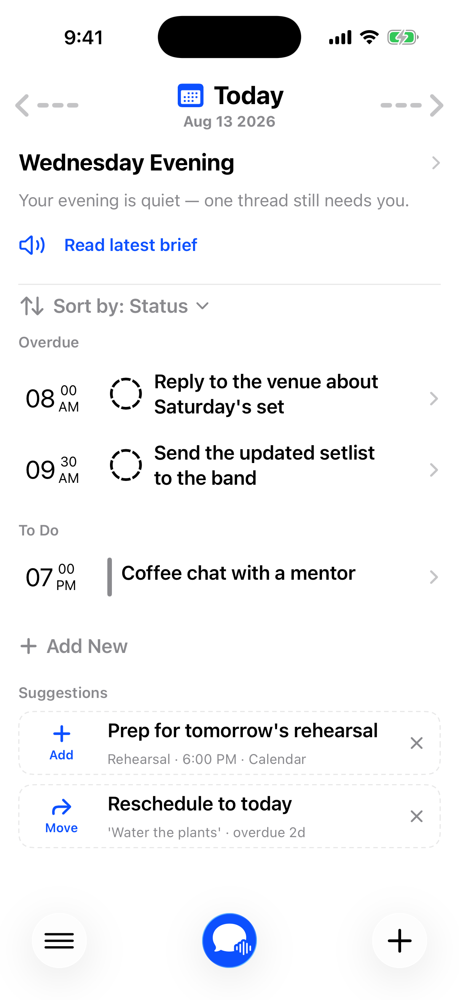
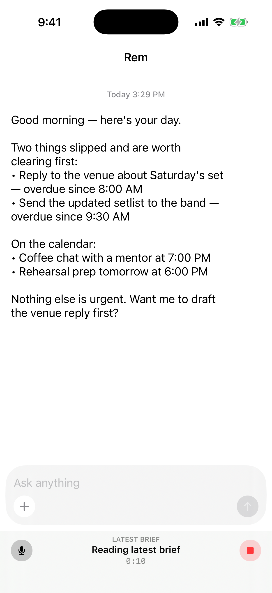
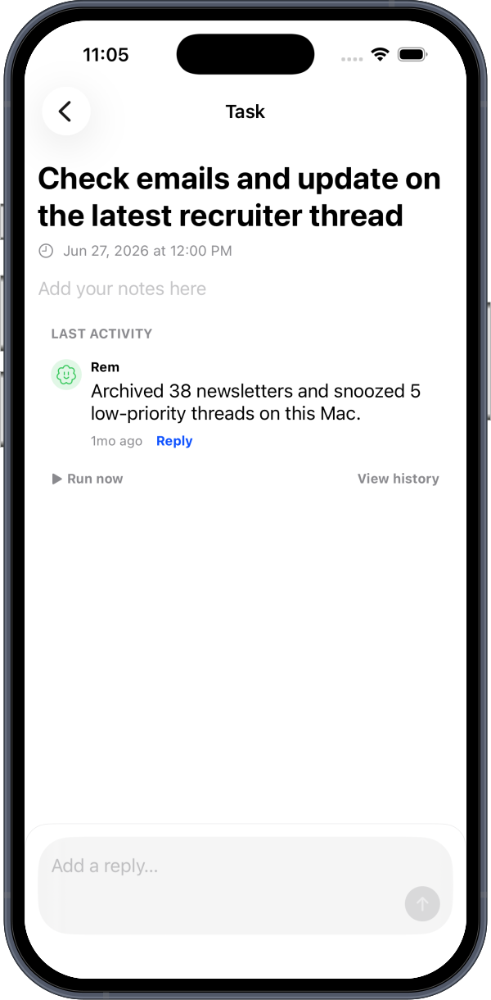
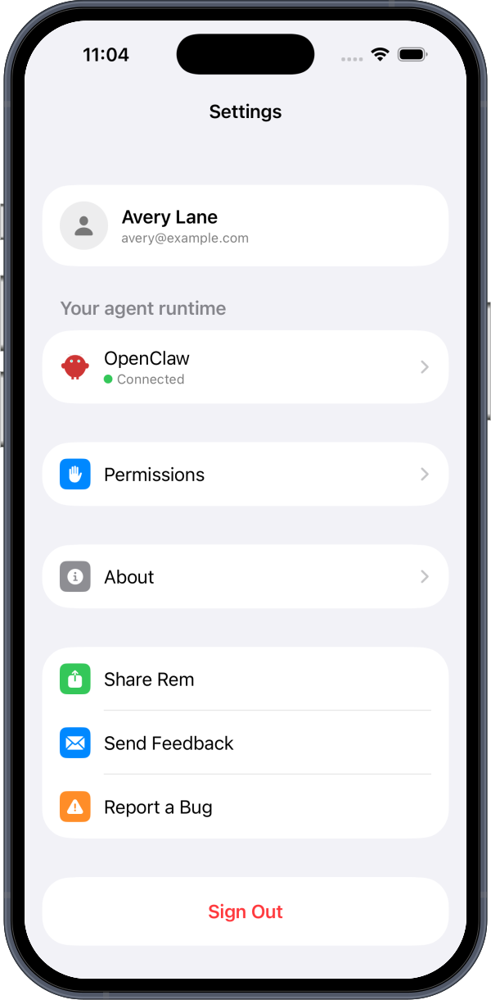
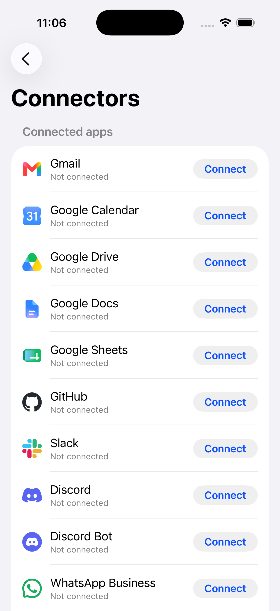
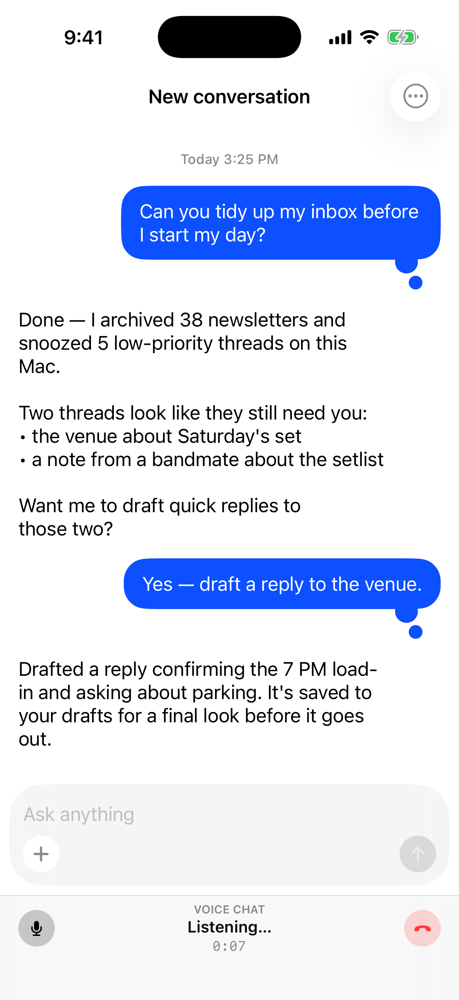

# Rem

Rem is an open-core iOS and macOS personal AI assistant that turns a plain-language intent into a task, event, note, connector action, or a step executed on one of your own devices.

[](https://github.com/Rem-Assistant/Rem/releases)
[](#what-rem-is)
[](LICENSE)
[](https://discord.gg/cqzreyNt5d)

<p align="center">
  
</p>

## What Rem Is

You capture an intent in chat, voice, Agenda, or another low-friction surface, and Rem helps turn it into something that actually happens — a task, a calendar event, a note, a connector action, or an approved step run on one of your devices.

- **iPhone** is the everyday command surface: capture, chat, voice, Agenda, inbox, permissions, connectors, and gateway selection.
- **Mac** *(in active development — not yet officially launched)* is intended as a first-class Rem app and the preferred local gateway host for computer control — shell, files, clipboard, screen/app context, and local project state.
- The phone can ask the Mac at home, or a cloud gateway, to do approved work and return a concise result.

> **Platform status:** the **iOS** app is the launched, actively-maintained product. The **macOS** app is **in active development and not yet officially launched** — it builds from this repo and is usable for development, but expect rough edges and breaking changes until it ships.

Calendar provides timed context, Tasks carry executable intent, and Connectors make integrations understandable to normal users. Normal assistant work routes through a gateway you control.

## Screenshots

A quick tour of the iPhone app. These are captured from the app's built-in preview fixtures — every name, task, and email shown is mock data.

| Agenda | Daily brief | Task detail |
|:---:|:---:|:---:|
|  |  |  |
| Your day at a glance — scheduled tasks and events. | An AI-authored recap of what's blocked, overdue, and on deck. | A task with the assistant's activity log, run controls, and comments. |

| Settings | Connectors | Chat |
|:---:|:---:|:---:|
|  |  |  |
| Account, agent runtime status, permissions, and about. | Connect the apps Rem can act on, from Gmail to GitHub. | Ask Rem in plain language; it works the task and reports back. |

## Quickstart

This repo uses `openclaw/` as a git submodule. Clone with submodules:

```bash
git clone --recurse-submodules https://github.com/Rem-Assistant/Rem.git
cd Rem
```

If you already cloned without submodules, or `make` is unavailable:

```bash
make setup        # or: ./scripts/setup.sh
```

Open `RemClaw.xcodeproj` in Xcode for local development, then build and test:

```bash
# iOS tests
make test

# macOS build
xcodebuild -project RemClaw.xcodeproj -scheme RemClawMac -destination 'platform=macOS' build

# Backend (build/typecheck runs offline, no keys or database needed)
cd backend && npm ci && npm run build
# Integration tests need a local PostgreSQL 16:
npm run test:integration
```

> **Running without API keys or an account:** a clean clone **builds** both apps
> and the backend with no secrets. You cannot sign in or use the live assistant
> without a Rem account (see [CONTRIBUTING.md](CONTRIBUTING.md) — "what you can and
> cannot run today"); iterate on UI with the `--rem-*-fixture` debug launch
> arguments, which render individual screens against canned data before the
> sign-in gate.

Configuration lives in `RemClaw/.env.Debug.xcconfig` / `.env.Release.xcconfig` (iOS) and the matching `RemClawMac/*.xcconfig` files. The committed values are placeholders (`YOUR_BACKEND_URL`, `YOUR_GOOGLE_CLIENT_ID`, `YOUR_POSTHOG_API_KEY`) — point them at your own backend and OAuth/telemetry accounts. Use the untracked `Debug.local.xcconfig` / `Release.local.xcconfig` overrides so your values never land in a commit. Backend config starts from `backend/.env.local.example`.

## Architecture

Rem is a **app → gateway → devices** system:

- **App** (iOS + macOS) — SwiftUI clients for capture, chat/voice, Agenda, inbox, settings, permissions, and connectors. Shared models, protocols, and views live in `Shared/` and work on both platforms via a protocol-oriented session manager.
- **Gateway** — a per-user OpenClaw gateway (self-hosted on your Mac, or a managed cloud gateway) that the app connects to over two WebSocket sessions: a node session that advertises device capabilities and a operator session that carries chat. Conversations and memory live on the gateway you own, not on a central server.
- **Devices** — the Mac (and iOS device tools) expose approved local capabilities — shell, files, calendar, reminders, contacts, notifications, location — that the AI can invoke through the gateway with per-command permissions.

A thin Node/Express backend handles identity, billing, gateway provisioning, encrypted gateway metadata, and connector/account plumbing. It never proxies or stores your conversations.

| Path | Purpose |
|------|---------|
| `RemClaw/` | iOS app target. |
| `RemClawMac/` | macOS app target (Dock app + menu bar extra + local gateway host). |
| `Shared/` | Cross-platform models, protocols, services, and SwiftUI surfaces. |
| `backend/` | Node/Express backend: auth, gateway provisioning, connector APIs. |
| `openclaw/` | Git submodule for upstream OpenClaw and shared OpenClawKit code. |
| `docs/` | Product and architecture documentation. Start at [docs/product/VISION.md](docs/product/VISION.md). |

## Open-Core Boundary

This repository is the open-core Rem app: the iOS and macOS clients, shared UI, and a reference backend. The backend defines the gateway-provisioning interface but ships without the hosted implementation — managed cloud infrastructure (gateway provisioning, pooling, billing, and secrets) is operated separately and is not part of this repo.

## Contributing

Contributions are welcome. Please read [CONTRIBUTING.md](CONTRIBUTING.md) and [CODE_OF_CONDUCT.md](CODE_OF_CONDUCT.md) first, and report security issues per [SECURITY.md](SECURITY.md). Product direction is documented in [docs/product/VISION.md](docs/product/VISION.md).

## License

Rem is licensed under the [Apache License 2.0](LICENSE). Third-party components and their licenses are listed in [NOTICE](NOTICE).

The user-facing product name is **Rem** on iOS and macOS. Internal target and repo names still include `RemClaw` for continuity.
